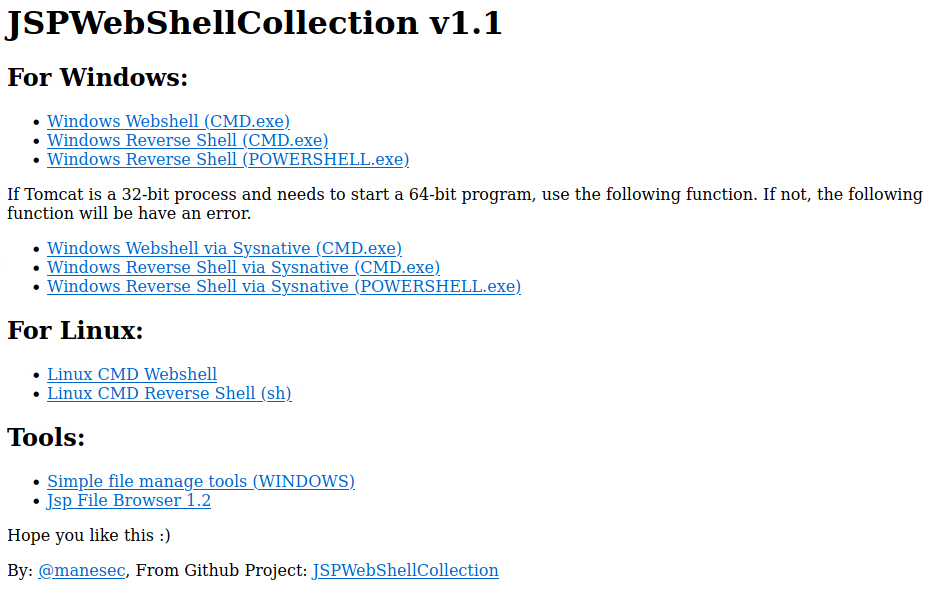

# JSPWebShellCollection
Backdoor collection for tomcat.

This is backdoor project, `war` file will be in Releases.

## Demo

## Note

If you are success to upload and open it up show 404, you may need to browse `http://<tomcat_url>/JSPCollection/index.jsp` manualy.

## Support
### For Windows:

+    Windows Webshell (CMD.exe)
+    Windows Reverse Shell (CMD.exe)
+    Windows Reverse Shell (POWERSHELL.exe)

If Tomcat is a 32-bit process and needs to start a 64-bit program, use the following function. If not, the following function will be have an error.

+    Windows Webshell via Sysnative (CMD.exe)
+    Windows Reverse Shell via Sysnative (CMD.exe)
+    Windows Reverse Shell via Sysnative (POWERSHELL.exe)

### For Linux:

+    Linux CMD Webshell
+    Linux CMD Reverse Shell (sh)

### Tools:

+    Simple file manage tools (WINDOWS)
+    Jsp File Browser 1.2

## Version 
1.1

